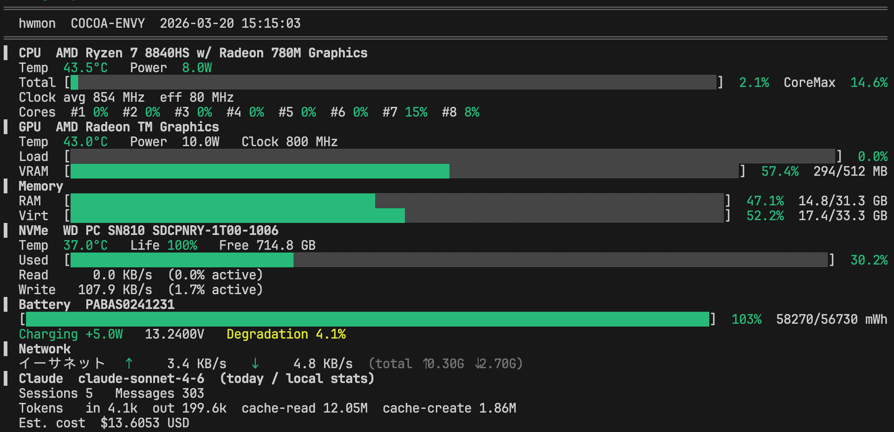

# 概要

[LibreHardwareMonitor](https://github.com/LibreHardwaRemonitor/LibreHardwareMonitor) の HTTP API からセンサーデータを取得し、`top` 風にターミナル表示するツールです。

ついでに Claude の利用状況もなんとなく表示します。

このプログラム自体は表示したら終了するので、 `watch -n 2 hwmon` のようにして使うと `top` っぽくなります。

## スクショ

# ライセンス

MIT License

ただし `src/cJSON.c`, `src/cJSON.h` は [cJSON](https://github.com/DaveGamble/cJSON) のコードを含んでいます（MIT License, Copyright (c) 2009-2017 Dave Gamble and cJSON contributors）。

# その他

C わからないけど軽いのが欲しかったんで Claude Code に作らせてみた習作です。
